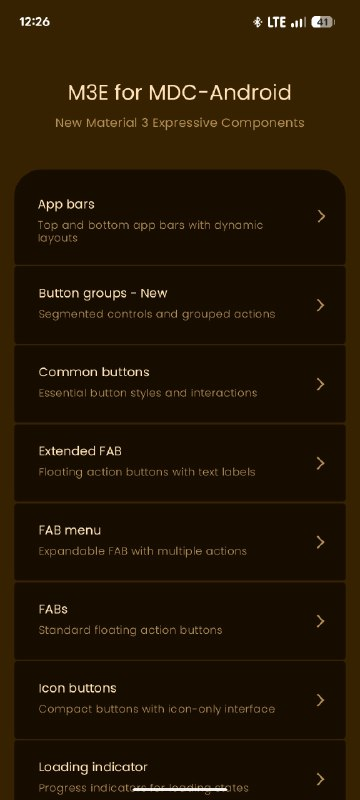
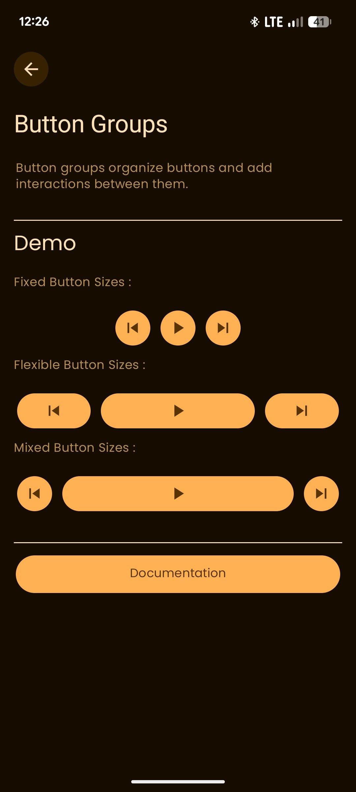
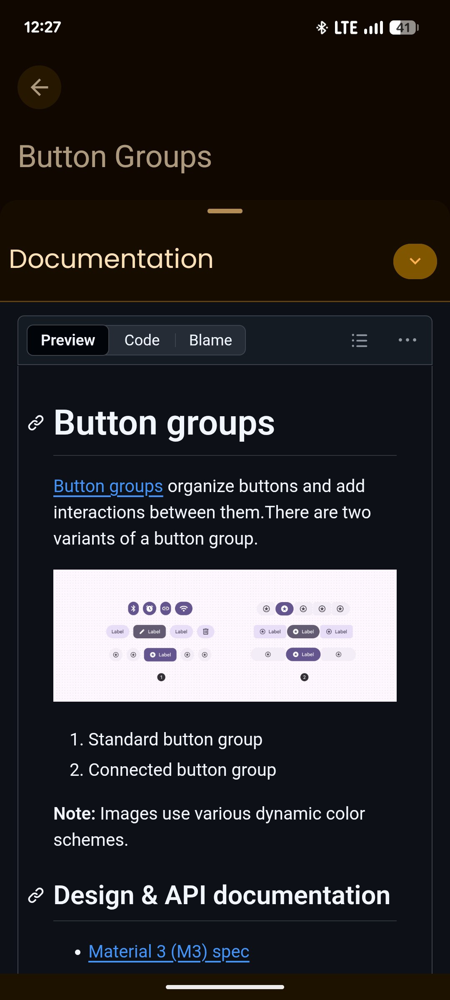

# M3E MDC-Android
App that showcase a new Material 3 Expressive Components For Native Android

## Screenshot
<div style="display: flex; justify-content: space-around;">
  
  
  
</div>

## Tech Stack
- **Language:** Java
- **UI:** XML Layouts
- **Design:** Material 3 with Dynamic Colors
- **Architecture:** Native Android

## Getting Started
1. Clone the repository
```bash
https://github.com/alfahrelrifananda/Rel-Music.git
```
2. Open the project in Android Studio
3. Build and run the app!

## Requirements
- Android Studio
- Minimum SDK: API 24 (Android 7.0)
- Target SDK: API 34

## Contributing
Feel free to open issues or submit pull requests. All contributions are welcome!